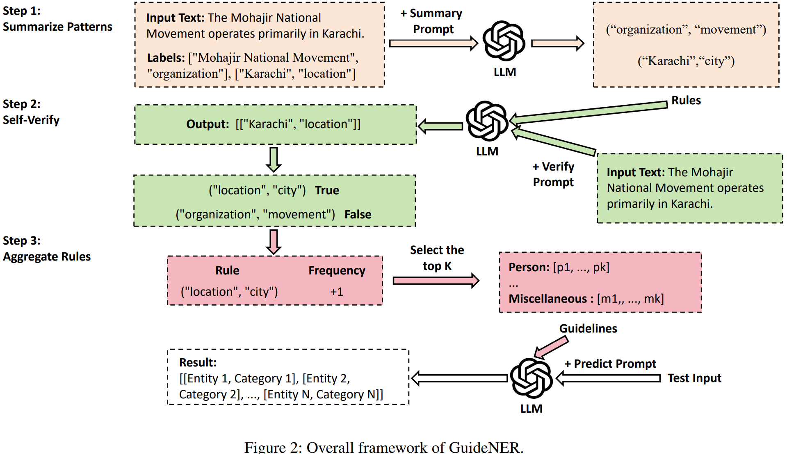

# GuideNER: Annotation Guidelines Are Better than Examples for In-Context Named Entity Recognition
The pytorch implementation of "GuideNER: Annotation Guidelines Are Better than Examples for In-Context Named Entity Recognition " (AAAI 2025).

The framework of GuideNER is shown in the following figure:



## Enviroment
We recommend the following actions to create the environment:

```bash
conda create -n  GuideNER python==3.9.19
conda activate GuideNER
pip install jinja2==3.1.4
pip install transformers==4.43.3
pip install vllm==0.5.3.post1
pip install tokenizers ==0.19.1
```

## Datasets
Due to licensing restrictions, we can only provide the `CoNLL03` dataset along with related prompts. Both the original and the processed datasets are placed in the `datasets` folder. The processed data is in JSONL format, and each entry contains the keys "text" and "entity_labels", as shown below:
```json
{"text": "EU rejects German call to boycott British lamb .", "entity_labels": [["EU", "organization"], ["German", "miscellaneous"], ["British", "miscellaneous"]]}
```

## Running
First, you need to run `python rule_summary.py` to summarize the guidelines corresponding to the dataset. Then, execute `python run_withrule.py` to perform inference and obtain the results.